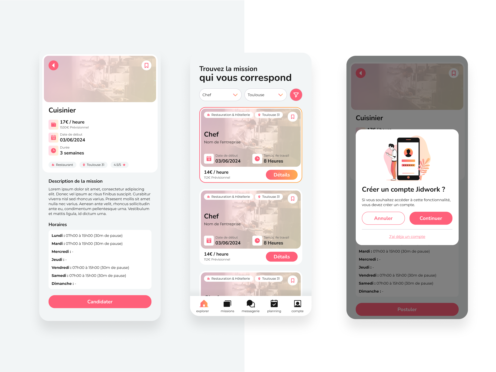
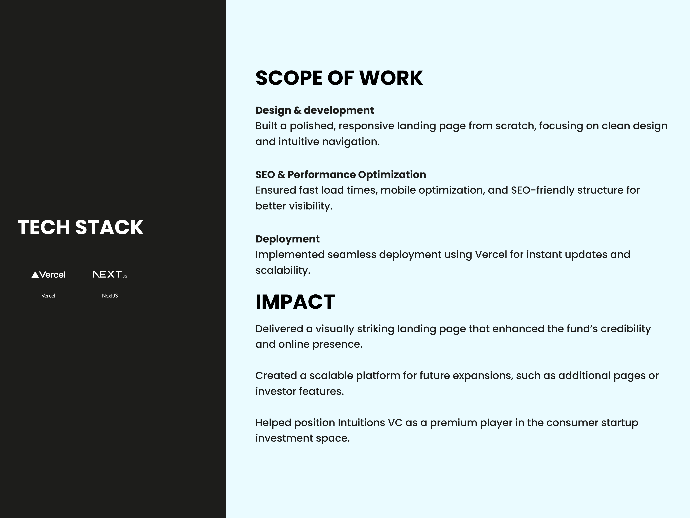

# 👋 Hey, I’m Soma Bini  

🚀 **CTO / Senior Software Engineer / Startup Builder** based in Dubai 🇦🇪  
With over **10 years of experience in early-stage startups**, I help founders and teams go from **0 → 1** — designing scalable architectures, leading engineering teams, and shipping reliable, production-ready systems fast.  

I’m deeply passionate about building strong engineering cultures, turning MVPs into scalable products, and aligning tech strategy with business impact.  

---

### 🧰 **Tech Stack**
`Golang` · `NodeJS` · `TypeScript` · `React` · `NextJS` · `Docker` · `Kubernetes` · `Terraform` · `AWS` · `GCP` · `MongoDB` · `PostgreSQL`

---

### 🧠 **Core Expertise**
- Early-stage startup architecture & execution (from MVP to scale)  
- Cloud-native systems (AWS, GCP, Kubernetes, Terraform)  
- Backend development in **Golang** & **Node.js** (GraphQL, gRPC, REST)  
- Frontend with **Next.js / React / TypeScript**  
- CI/CD automation with GitLab, ArgoCD, Docker  

---

### 💬 **About Me**
I thrive in **fast-paced environments**, love taking complex technical challenges and transforming them into clear, scalable systems.  
I’ve worked with both founders and enterprise teams — delivering impact, mentoring engineers, and creating long-lasting technical foundations.

---

## 💡 **Projects Built from Scratch**

Each of these projects started from a blank repo — I handled the architecture, backend, frontend, and DevOps end-to-end.

---

### 🧠 Heex Technologies

**Problem:** The platform had severe scalability issues, high cloud costs, and unreliable infrastructure — blocking enterprise clients like Renault, SNCF, etc ...

**Solution:** I led the complete re-architecture: migrated from REST/NodeJS to GraphQL/Golang, replaced MariaDB with MongoDB, and built a fully cloud-native stack with Kubernetes, ArgoCD, and Terraform.

**Impact:** Achieved zero-downtime deployments, horizontally scalable APIs, and major performance gains while cutting operational costs.

**Stack:** Go • gRPC • GraphQL • MongoDB • Kubernetes • Terraform • ArgoCD • GitLab CI

  
  
  
  
  

---

### 🤖 Survaii

**Goal:** Build an AI-driven platform that rewards users in crypto or fiat for answering surveys.  

**My Role:** Designed the full system architecture, developed the backend in Go with GraphQL APIs, and created a Next.js frontend.

**Highlights:** Implemented real-time analytics, a crypto payment engine, and AWS-based scaling.

**Impact:** Delivered a secure MVP ready for production — the foundation for a new way of monetizing insights.

**Stack:** Go • Next.js • GraphQL • AWS • Kubernetes • MongoDB • GitLab CI

  
  
  
  
  
  
  
  
  

---

### 📢 Brands To Medias

**Problem:** The original product was a no-code prototype that couldn’t scale for enterprise clients (Publicis, Reworld, Havas).

**My Role:** Rebuilt the platform from scratch with a Node.js + Next.js architecture, implemented ad-serving logic, and set up CI/CD with GitLab.

**Impact:** Delivered a robust AdTech platform ready for B2B clients, reduced deployment times from hours to minutes, and simplified future feature delivery.

**Stack:** Node.js • Next.js • TypeScript • GCP • MongoDB • Docker • GitLab CI

  
  
  
  
  
  
  

---

### 🌍 Broke & Abroad

**Context:** A travel startup with 300K+ community members needed to move beyond a single PHP VM and scale globally.

**My Role:** Re-engineered the full stack: built a Next.js web app, React-based back office, and Golang GraphQL API.

**Impact:** Cloud migration to AWS with CI/CD automation cut release time from hours to 5 minutes and made the platform ready for tens of thousands of concurrent users.

**Stack:** Go • GraphQL • Next.js • AWS • Docker • MongoDB • GitLab CI

  
  
  
  
  
  
  

---

### ⚙️ Jidwork
**Goal:** Build a marketplace connecting companies with on-demand field freelancers (plumbers, waiters, electricians...).

**My Role:** Defined the system architecture, designed databases, built the Golang GraphQL backend and Next.js frontend, and automated deployments on GCP.

**Impact:** Delivered a production-ready platform supporting real-time job matching, ready for commercial launch within weeks.

**Stack:** Go • GraphQL • Next.js • GCP • Docker • MongoDB • GitLab CI

  
  
  
  
  
  
  
  

### 🧭 Les Prochains Leaders

**Context:** Non-profit founded by NBA champion Axel Toupane to empower young entrepreneurs.

**My Role:** Built a custom landing page with Next.js instead of WordPress to better reflect the mission and brand storytelling.

**Impact:** Delivered a high-performance, SEO-optimized site that showcases the foundation’s initiatives and inspires young creators.

**Stack:** Next.js • TypeScript • Vercel

  
  
  
  
  
  
  
  
  

### 💼 Intuitions VC

**Context:** A private equity fund backed by athletes like Raphael Varane and Axel Toupane wanted a sleek online presence reflecting their high-end brand.

**My Role:** Designed and developed a responsive landing page with Next.js, focusing on minimalism, clarity, and high performance.

**Impact:** Delivered a visually elegant website that elevated the fund’s image and SEO visibility, with future scalability for investor features.

**Stack:** Next.js • TypeScript • Vercel

  
  
  
  

---
# 📥 Contact
📧 [binisoma@gmail.com](mailto:binisoma@gmail.com)  
🌍 [LinkedIn](https://linkedin.com/in/soma-bini)
